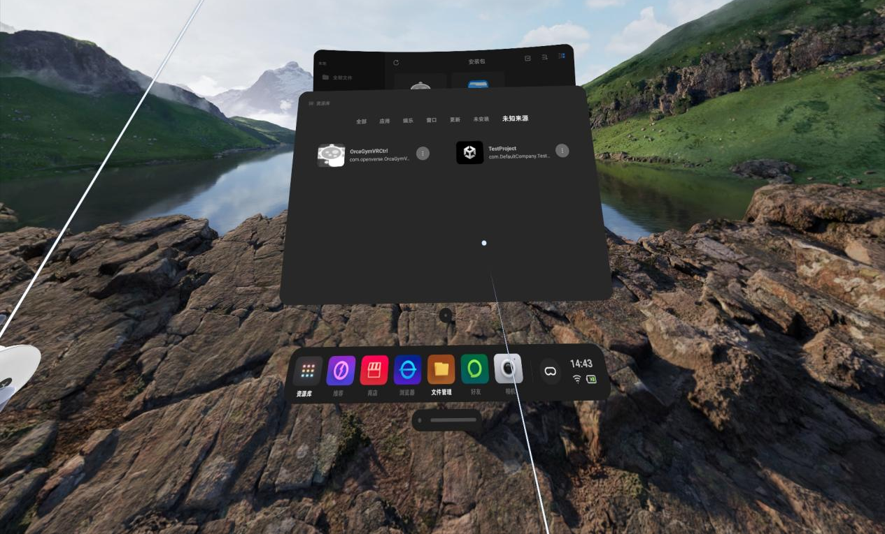

# VR遥操作与数据采集操作指南

松应OrcaLab使用VR遥操进行数据采集任务，需遵循特定流程配置硬件连接、启动程序。以下为详细操作指南，包含VR遥操作与数据采集的步骤、参数说明及常见问题解决方案。

---

## 一、数据采集软件硬件环境准备
 - **OrcaManipulation** 开源代码库下载
 - **VR操作设备** （如Pico Ultra 4配套手柄）
 - **场景资源** 订阅
 
### 1.1 从github获取OrcaManipulation代码仓库。

```bash
git clone https://github.com/openverse-orca/OrcaManipulation.git
# 进入项目目录
cd OrcaPlayground
# 安装项目依赖
pip install -r requirements.txt
```

### 1.2 VR遥操作设备准备

VR遥操作需先完成硬件连接与软件初始化，数据采集时，通过手柄控制机械臂执行任务并采集数据。

**步骤1** ：安装 `PicoController.apk` 程序
 - 使用 USB 线将 Pico 连接电脑，并开机。
 - 将`PicoController.apk` 复制到PICO设备目录中 (所在目录：OrcaManipulation/src/examples/超市场景青龙机器人数采案例/pico安装包）

 - 佩戴VR设备，在 VR 视角中，找到文件管理器，查看安装包目录，使用右手手柄点击 **A 键**，确认安装刚刚下载的 apk 包。

**步骤2** ：打开VR设备开发者模式
 - 在 VR 视角中，点击：  **设置 → 关于本机 → 软件版本号**， 使用确认键 **A 键** 对着软件版本号。 连续点击 **6–7 次**，调出开发者模式。  
 - 打开调试开关。

**步骤3**：启动VR端OrcaGymCtrl程序 
 - 开启VR设备，选择底部的「资源库」（Pico Ultra 4设备直接在资源库中查找“OrcaGymCtrl”）。
 
 - VR启动后会提示设置安全边界，可选择“重设边界”或“保持原有边界”（默认配置）。
 - 启动OrcaGymCtrl后，会进入3D程序界面：左侧显示三维红蓝绿坐标轴，中间有红色文字启动OrcaGymCtrl后，会进入3D程序界面：左侧显示三维红蓝绿坐标轴，中间有红色文字。**后续VR遥操作需始终保持此界面激活**。
 

**步骤4** ：安装adb工具
在Ubuntu终端中执行以下命令，安装Android调试工具（adb）
 ```bash
sudo apt install android-tools-adb android-tools-fastboot
```
 **步骤5**：建立PICO与PC的通信连接
- 使用USB数据线连接Pico设备与PC。
- 执行以下命令反向映射端口（确保通信正常）：
    
```bash
 adb reverse tcp:8001 tcp:8001
```
- ⚠️**注意**：每次重启PC或断开PICO的USB连接后，需重新执行此命令。执行成功会提示“start successful”；若已执行过该命令，再次执行可能无输出，属于正常现象。

 ### 1.3 场景资产包准备 

 以 `青龙机器人` + `超市场景` 为例。 
  
 **订阅相关资产**

1. 资产库链接: https://simassets.orca3d.cn/

2. 资产中心 → 生活资产 → 订阅 **ShopScene_Scaning**


3. 资产中心 → 机器人资产 → 订阅 **openloong**


  
## 二、遥操作数据采集

完成以上准备工作后，以 `青龙机器人` + `超市场景` 为例，开始数据采集任务。

 - **确认PICO 连接正常**：
   - 启动OrcaGymCtrl后，会进入3D程序界面：左侧显示三维红蓝绿坐标轴；
   - adb 端口连接成功。
 - **资产包订阅成功**：个人中心有已订阅`ShopScene_Scaning`、`openloong`资产包，

  
  ### 2.1 打开 OrcaLab 中的场景与布局

1. 终端进入 OrcaLab 安装的 conda 环境：
```bash
#激活orcalab conda环境
conda activate orcalab
```
2. 执行命令启动 OrcaLab：
```bash
#启动OrcaLab
orcalab
```
3. 启动过程中会自动下载已订阅的资产，请等待下载与同步完成。


4. 资产下载完成后，在选择场景弹框中，选择 **shop 场景** ，选择默认布局。


5. 在 OrcaLab 客户端菜单栏中，选择 **打开布局**，加载 `shop_openloong.json` 文件。
```bash
#JSON 文件路径：
  ~/OrcaManipulation/src/examples/超市场景青龙机器人数采案例/shop_openloong.json
```


### 2.2 启动仿真

1. 点击界面右上角 **绿色启动按钮**
2. 选择 **无仿真程序（手动启动）**


### 2.3 开启数采脚本

1. 激活数采脚本所需 conda 环境：
```bash
conda activate orcalab
```

2. 进入数采脚本目录并启动
```bash
cd ~/OrcaManipulation/src/examples/dataCollection
#启动数据采集脚本
python data_collection_tele.py
```

### 2.4 VR遥操作开始数据采集

1. **机械臂复位** 进入抓取模式
   - 依次按压 **左摇杆**、**右摇杆**
   - 仿真环境中机械臂可移动，机器人进入抓取操作模式

2. **手柄功能映射**

   - **左手手柄**
     - **Y 键长按**：左手抓取
     - **X 键**：左手放开

   - **右手手柄**
     - **B 键长按**：右手抓取
     - **A 键长按**：右手放开


   

   
